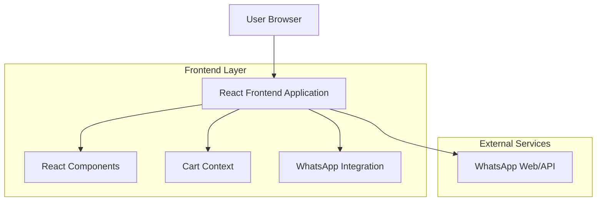

## 1. Architecture design



## 2. Technology Description
- Frontend: React@18 + tailwindcss@3 + vite
- Initialization Tool: vite-init
- Backend: None (static application)
- Icons: lucide-react
- State Management: React Context API
- Deployment: GitHub Pages

## 3. Route definitions
| Route | Purpose |
|-------|---------|
| / | Home page, displays the complete menu and cart functionality |

## 4. Component Architecture

### 4.1 Core Components
```typescript
// Product Type Definition
interface Product {
  id: number;
  name: string;
  price: number;
  category: string;
  description?: string;
}

// Cart Item Type
interface CartItem extends Product {
  quantity: number;
}

// Cart Context Type
interface CartContextType {
  items: CartItem[];
  addItem: (product: Product) => void;
  removeItem: (productId: number) => void;
  updateQuantity: (productId: number, quantity: number) => void;
  clearCart: () => void;
  total: number;
}
```

### 4.2 Component Structure
- **App**: Main application wrapper, provides cart context
- **Header**: Branding and contact information
- **Hero**: Main banner with business presentation
- **MenuSection**: Container for menu categories
- **CategoryTabs**: Navigation between food categories
- **ProductCard**: Individual product display with add to cart functionality
- **Cart**: Modal component showing selected items
- **CartItem**: Individual item in cart with quantity controls
- **FloatingCartButton**: Fixed cart trigger with item count
- **WhatsAppButton**: Integration for order submission

## 5. Data Structure

### 5.1 Menu Data
```javascript
const menuData = {
  complete: [
    { id: 1, name: "Carne Completo", price: 29.00, category: "complete", description: "Acompanha: Vatapá, Vinagrete, Batatonese, Farofa, Arroz" },
    { id: 2, name: "Frango Completo", price: 28.00, category: "complete", description: "Acompanha: Vatapá, Vinagrete, Batatonese, Farofa, Arroz" },
    { id: 3, name: "Misto Carne e Calabresa", price: 28.00, category: "complete", description: "Acompanha: Vatapá, Vinagrete, Batatonese, Farofa, Arroz" }
  ],
  simple: [
    { id: 4, name: "Carne com Farofa", price: 17.00, category: "simple" },
    { id: 5, name: "Misto com Farofa", price: 17.00, category: "simple" },
    { id: 6, name: "Frango com Farofa", price: 17.00, category: "simple" },
    // ... additional simple options
  ],
  portions: [
    { id: 16, name: "Arroz", price: 9.00, category: "portions" },
    { id: 17, name: "Batatonese", price: 15.00, category: "portions" },
    // ... additional portions
  ]
};
```

### 5.2 WhatsApp Message Format
```javascript
function generateWhatsAppMessage(items, total) {
  const phoneNumber = "5592991298846";
  const message = `🍢 *PEDIDO ESPETINHO SMART* 🍢\n\n` +
    items.map(item => `• ${item.quantity}x ${item.name} - R$ ${(item.price * item.quantity).toFixed(2)}`).join('\n') +
    `\n\n*Total: R$ ${total.toFixed(2)}*\n\n` +
    `Obrigado pelo pedido! 🙏`;
  
  return `https://wa.me/${phoneNumber}?text=${encodeURIComponent(message)}`;
}
```

## 6. State Management

### 6.1 Cart Context Implementation
```javascript
const CartProvider = ({ children }) => {
  const [items, setItems] = useState([]);
  
  const addItem = (product) => {
    setItems(prev => {
      const existing = prev.find(item => item.id === product.id);
      if (existing) {
        return prev.map(item => 
          item.id === product.id 
            ? { ...item, quantity: item.quantity + 1 }
            : item
        );
      }
      return [...prev, { ...product, quantity: 1 }];
    });
  };
  
  const total = items.reduce((sum, item) => sum + (item.price * item.quantity), 0);
  
  return (
    <CartContext.Provider value={{ items, addItem, removeItem, updateQuantity, clearCart, total }}>
      {children}
    </CartContext.Provider>
  );
};
```

## 7. Styling Guidelines

### 7.1 Tailwind Configuration
```javascript
// tailwind.config.js
module.exports = {
  theme: {
    extend: {
      colors: {
        'espetinho-orange': '#FF6B35',
        'espetinho-brown': '#3E2723',
        'espetinho-cream': '#FFF8F3',
        'espetinho-green': '#4CAF50',
      },
      fontFamily: {
        'sans': ['Inter', 'Roboto', 'system-ui', 'sans-serif'],
      },
    },
  },
}
```

### 7.2 Responsive Breakpoints
- Mobile: 375px - 767px (single column layout)
- Tablet: 768px - 1023px (two column grid)
- Desktop: 1024px+ (three-four column grid)

## 8. Performance Considerations

### 8.1 Optimization Strategies
- Lazy loading for product images
- Memoization for expensive calculations (cart total)
- Code splitting for modal components
- Optimistic UI updates for cart operations

### 8.2 Bundle Size Management
- Tree shaking for unused icons from lucide-react
- Dynamic imports for heavy components
- Minification and compression for production build
- Service worker for offline functionality (optional)

## 9. Deployment Configuration

### 9.1 GitHub Pages Setup
```json
// package.json
{
  "homepage": "https://[username].github.io/espetinho-smart",
  "scripts": {
    "predeploy": "npm run build",
    "deploy": "gh-pages -d dist"
  }
}
```

### 9.2 Build Optimization
- Enable gzip compression
- Set proper cache headers for static assets
- Configure SPA routing for GitHub Pages
- Optimize images for web delivery