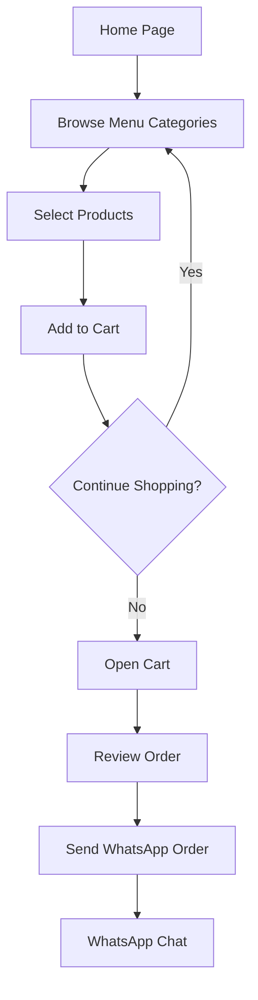

## 1. Product Overview
Landing page para o Espetinho Smart, um empreendimento local de venda de espetinhos. A solução permite aos clientes visualizarem o cardápio, montarem seus pedidos e enviarem via WhatsApp de forma simples e rápida.

O produto visa modernizar o processo de pedidos do estabelecimento, oferecendo uma experiência digital fluida para o cliente final e facilitando o gerenciamento de pedidos para o proprietário.

## 2. Core Features

### 2.1 User Roles
| Role | Registration Method | Core Permissions |
|------|---------------------|------------------|
| Customer | No registration required | Browse menu, add items to cart, send orders via WhatsApp |

### 2.2 Feature Module
O sistema consiste nas seguintes páginas principais:
1. **Home page**: hero section com identidade visual, seção de categorias do cardápio, lista de produtos por categoria.
2. **Cart**: visualização do carrinho com itens selecionados, cálculo do valor total, botão para finalizar pedido.

### 2.3 Page Details
| Page Name | Module Name | Feature description |
|-----------|-------------|---------------------|
| Home page | Hero section | Display brand identity with appetizing food imagery, contact information and call-to-action. |
| Home page | Menu categories | Show categorized menu sections: Espetinhos Completos, Espetinhos Simples, Porções. |
| Home page | Product cards | Display each item with name, price, description and add to cart button. |
| Home page | Floating cart | Show cart icon with item count indicator, opens cart modal when clicked. |
| Cart | Item list | Display selected items with quantity controls, individual prices and remove option. |
| Cart | Total calculation | Calculate and display order total with itemized breakdown. |
| Cart | WhatsApp integration | Generate formatted message with order summary and redirect to WhatsApp (92) 99129-8846. |

## 3. Core Process
O fluxo principal do usuário começa na página inicial onde o cliente visualiza o cardápio organizado por categorias. O usuário pode adicionar itens ao carrinho clicando nos botões de cada produto. O carrinho flutuante mostra o número de itens selecionados. Ao clicar no carrinho, o cliente visualiza todos os itens, pode ajustar quantidades ou remover produtos. Após revisar o pedido, o cliente clica em "Finalizar Pedido" e é redirecionado para o WhatsApp com uma mensagem pré-formatada contendo todos os itens do pedido e o valor total.

## 4. User Interface Design

### 4.1 Design Style
- **Primary colors**: Warm orange (#FF6B35) and dark brown (#3E2723) to evoke appetite and warmth
- **Secondary colors**: Cream (#FFF8F3) and fresh green (#4CAF50) for accents
- **Button style**: Rounded corners with subtle shadows, hover effects with color transitions
- **Font**: Modern sans-serif (Inter or Roboto), 16px base size with clear hierarchy
- **Layout style**: Card-based design with generous spacing, mobile-first approach
- **Icons**: Food-related icons from Lucide React library, appetizing emoji for categories

### 4.2 Page Design Overview
| Page Name | Module Name | UI Elements |
|-----------|-------------|-------------|
| Home page | Hero section | Full-width banner with high-quality food photography, overlay text with business name, WhatsApp contact button, responsive height adjusting to screen size. |
| Home page | Menu categories | Horizontal scrolling category pills on mobile, grid layout on desktop, each category with representative icon and name, active state highlighting. |
| Home page | Product cards | Grid layout (2 columns mobile, 3-4 desktop), card with product image placeholder, name in bold, price highlighted in orange, add button with plus icon. |
| Home page | Floating cart | Circular button fixed bottom-right, orange background with white icon, badge showing item count, smooth animation on item addition. |
| Cart | Modal overlay | Semi-transparent backdrop, white modal with rounded corners, max-height with scroll for long orders, close button top-right. |
| Cart | Item list | Horizontal layout with product name and quantity stepper, trash icon for removal, individual prices aligned right, divider between items. |
| Cart | Checkout section | Total amount prominently displayed, green WhatsApp button with icon, "Enviar Pedido" text, disclaimer about delivery time. |

### 4.3 Responsiveness
Mobile-first design approach with progressive enhancement for larger screens. Touch-optimized interactions with appropriately sized tap targets (minimum 44px). Responsive typography scaling from 14px on small devices to 18px on desktop. Flexible grid layouts adapting from single column on mobile to multi-column on tablet/desktop.

### 4.4 Visual Elements
Include placeholder images for all food items with consistent styling - well-lit, appetizing photography on clean backgrounds. Use food-related illustrations for categories when specific images aren't available. Implement smooth transitions and micro-interactions for adding/removing items to enhance user experience.